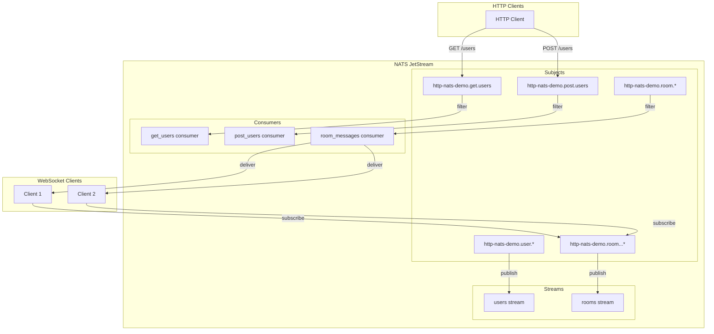

# NATSRun HTTP & WebSocket Demo

This demo showcases how to use NATSRun to build a real-time messaging application that combines HTTP and WebSocket protocols with NATS messaging. It demonstrates:

1. HTTP to NATS message routing with subject mapping
2. WebSocket real-time message reception
3. JetStream stream and consumer management
4. Template-based HTML rendering
5. Basic message routing patterns

## Features

- **HTTP to NATS Routing**: Maps HTTP requests to NATS subjects using a simple pattern
- **WebSocket Support**: Real-time message reception from NATS to browser
- **JetStream Integration**: Stream and consumer management with explicit acknowledgments

## Prerequisites

- Node.js 23.10+
- Docker and Docker Compose
- NATS CLI

## Setup

1. Install dependencies:
```bash
npm install
```

2. Start the NATS server with JetStream enabled:
```bash
docker-compose up -d
```

3. Start the demo:
```bash
npm start
```

## Architecture

The demo implements a basic messaging system with the following components:

### HTTP Server
- Maps HTTP requests to NATS subjects using pattern: `{prefix}.{method}.{path}`
- Serves HTML with Websocket connection and session IDs

### NATS Layer
- Routes messages between HTTP and WebSocket clients
- Manages JetStream streams and consumers

### WebSocket Layer
- Provides real-time message reception from NATS to browser
- Demonstrates server-to-client message flow
- Maintains persistent connections for message delivery

## Message Flow

1. **HTTP Request Flow**:
```
HTTP Request → NATS Subject (prefix.method.path) → NATS Consumer
```

2. **WebSocket Flow**:
```
NATS Producer → NATS Message → WebSocket Server → Browser Client
```

## API Endpoints

### HTTP Endpoints
- `GET /` - Serves the an entry page
- `GET /:roomId` - Serves a Chat Room page, connecting via WS to a roomId to receive messages

### WebSocket Endpoints
- `ws://localhost:3000/:roomId/:clientId` - WebSocket connection endpoint for receiving messages

## NATS Subjects

The demo uses the following subject patterns:
- HTTP requests: `{prefix}.{method}.{path}`
- WebSocket messages: `{prefix}.{roomId}.{clientId}.>`

## JetStream Configuration

The demo includes JetStream functionality for:
- Stream creation and management
- Consumer creation with explicit acknowledgments
- Message persistence and replay

## Cleanup

To stop the demo:

1. Stop the Node.js process (Ctrl+C)
2. Stop the NATS server:
```bash
docker-compose down
```

## Development

The demo is built with TypeScript and uses:
- `@nats-io/nats-core` for NATS connectivity
- `@nats-io/jetstream` for stream management
- `ws` for WebSocket support
- `angular-expressions` for simple templating
- `natsrun` for message routing

## License

MIT 

## Architecture



## Stream Configuration

### Users Stream
- **Name**: `users`
- **Subjects**: `http-nats-demo.>`
- **Retention**: `workqueue` (messages removed after acknowledgment)
- **Storage**: `memory`
- **Purpose**: Handle HTTP requests and user events

### Rooms Stream
- **Name**: `rooms`
- **Subjects**: `http-nats-demo.room.>`
- **Retention**: `limits`
- **Storage**: `memory`
- **Max Messages**: 1000
- **Purpose**: Store chat messages for replay

## Consumer Configuration

### HTTP Consumers
- **get_users**: Filters `http-nats-demo.get.users`
- **post_users**: Filters `http-nats-demo.post.users`

### Room Messages Consumer
- **room_messages**: 
  - Filters `http-nats-demo.room.>`
  - `deliver_policy: "all"` (delivers historical messages)
  - Used for message replay when clients connect

## Message Flow

1. **HTTP Requests**:
   - GET/POST requests are published to respective subjects
   - Messages are stored in the users stream
   - Consumers process and acknowledge messages

2. **Chat Messages**:
   - Messages are published to `http-nats-demo.room.{roomId}.{clientId}.>`
   - Stored in the rooms stream
   - New clients receive historical messages via the room_messages consumer
   - Real-time messages are delivered via direct subscription

## Current Issues

The demo currently has an issue where the room_messages consumer is not persisting between server restarts. This needs to be fixed by:

1. Ensuring the consumer is created with proper persistence settings
2. Adding error handling for consumer creation
3. Potentially using durable consumers for better reliability

## Usage

1. Start the NATS server
2. Run the demo: `npm start`
3. Connect to `http://localhost:3000/{roomId}`
4. Send messages through the WebSocket connection
5. New clients will receive message history when joining 